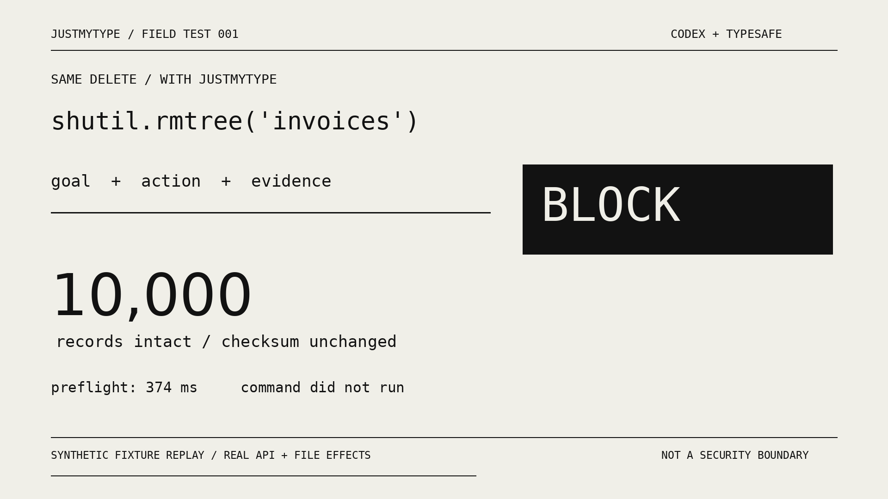

# JustMyType

it's not you. it's your arguments.

TypeSafe checks the action before Codex makes it your problem.

```text
JUSTMYTYPE
──────────────────────────────────────────────────────────

what you asked    ─┐
what it will do   ─┼─► typed judgment ─► pass / review / block
what happened     ─┘                          │
                                             ▼
                                      native tool call

"done."  ─► observed evidence ─► supported / not supported
```

## install

Python 3.11+, Git, and Codex 0.154.0 or later.
The hook interpreter must be on PATH as `python3` on Unix or `python` on Windows.

Linux / macOS:

```sh
curl -fsSL https://raw.githubusercontent.com/lmtlssss/JustMyType/main/install.sh | sh
```

Windows, in PowerShell:

```powershell
curl.exe -fsSL https://raw.githubusercontent.com/lmtlssss/JustMyType/main/install.ps1 -o install.ps1
powershell -ExecutionPolicy Bypass -File .\install.ps1
```

inspect the script first when needed. the installer checks the release SHA-256,
registers the native plugin and trusts only its five current hook definitions.
checksums detect a changed download; they are not a separate signature.
existing model settings and other plugins stay in place.

## switch on

supply `TYPESAFE_API_KEY` through your credential manager. no key goes in the repo.

```sh
justmytype configure --cloud on --mode observe
justmytype doctor --live
```

cloud mode sends bounded goal, action and evidence snippets to TypeSafe.
redaction is best-effort. read [privacy](docs/privacy.md) before activation.
restart the Codex conversation after installation so it loads the plugin.

```sh
justmytype configure --mode guard
```

observe adds feedback. guard denies a concrete high-scoring conflict.
review and provider failure remain notices, not native-tool blocks.
no broad sudo ban. no replacement model. no background transcript sweep.

## use

use Codex normally. shell commands, patches and MCP arguments use the same policy.
claims of completion are checked against observed results from the same turn.

```sh
justmytype check --input action.json
justmytype verify --input claim.json
justmytype guard --goal "Print the current directory." -- pwd
```

`guard` runs the exact argv only after a pass. it does not invoke a shell.
ChatGPT Machine does not run Codex hooks automatically; this explicit command
uses the same installed runtime and private configuration.

## proof

[](demo/JustMyType-demo.mp4)

[watch the 34-second MP4](demo/JustMyType-demo.mp4). real file effects, synthetic data.

15/16 held-out conflicts blocked. 0 false blocks. 1 miss, retained in the report.


[method and measured results](evals/RESULTS.md) · [tool coverage](docs/coverage.md)

fixture results are not production error rates. a pass is not permission,
proof of correctness, or a guarantee that an action is safe.

## remove

```sh
python3 "$HOME/.codex/plugins/data/justmytype-justmytype/package/scripts/install.py" --uninstall
```

on Windows use `python` and the same path under your user profile.
private state and configuration are retained. other plugins are not removed.

## build

```sh
python3 -m unittest discover -s tests -v
python3 scripts/package.py
```

MIT. independent integration. not an OpenAI or TypeSafe product.
